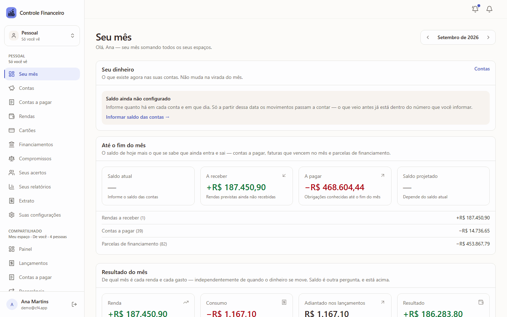
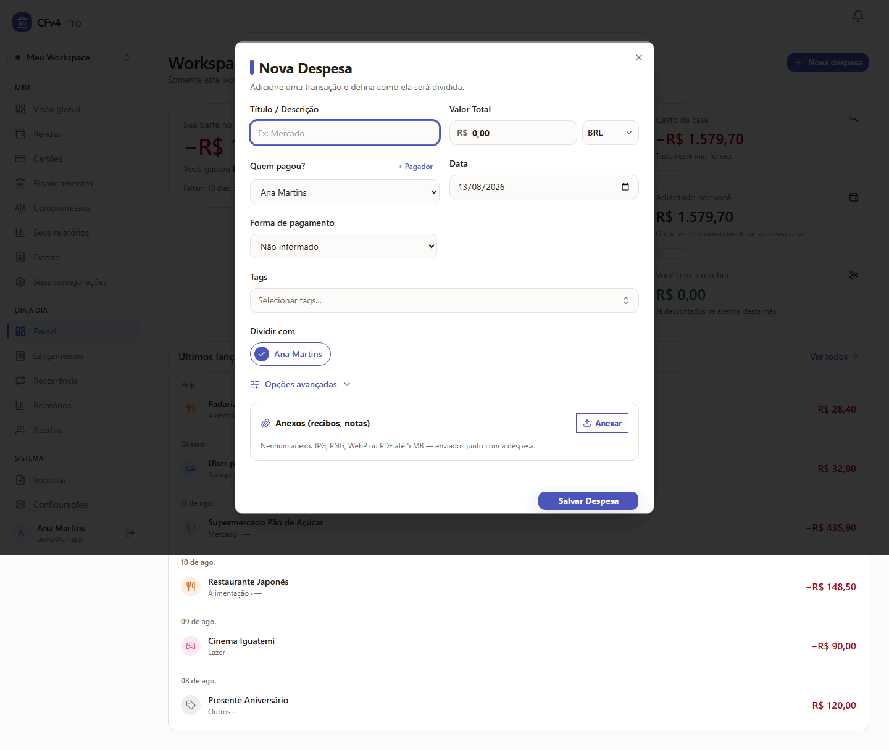
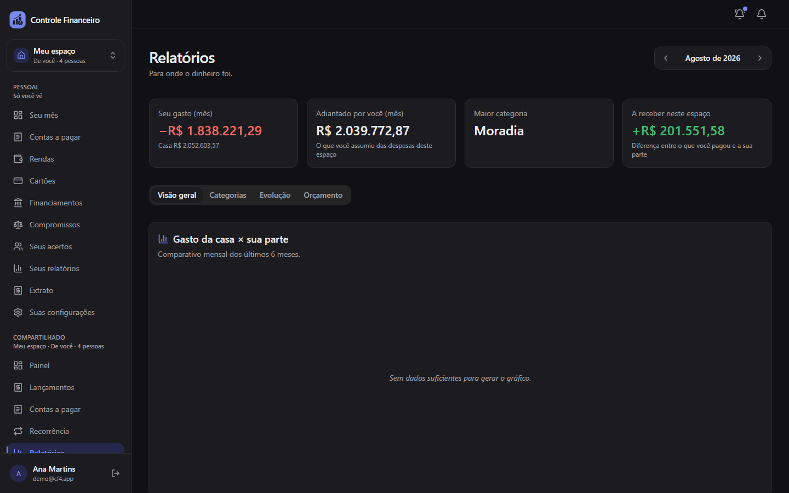
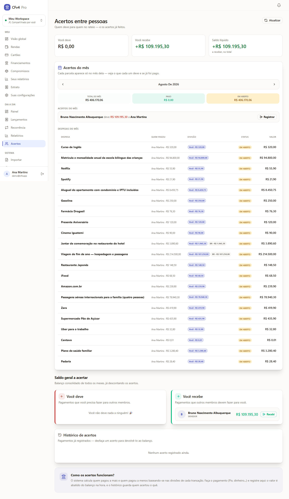

# Controle Financeiro V4

> Controle financeiro **pessoal e compartilhado**: gaste com clareza, divida despesas com quem quiser e saiba o saldo projetado do mês.

Aplicação full-stack para controlar gastos, **dividir despesas entre pessoas** (igual, porcentagem ou valor fixo — inclusive por item), gerenciar **cartões de crédito com faturas**, **recorrências**, **financiamentos** (SAC/PRICE), **importação de CSV**, **relatórios** e **previsão de fim de mês** — com **atualização em tempo real** entre os membros de um workspace via WebSocket.

**Stack:** FastAPI · SQLModel · Alembic · PostgreSQL (SQLite em dev) — React 19 · Vite · TypeScript · Tailwind/shadcn · TanStack Query · Zustand — Docker Compose (nginx + backend + Postgres).

---

## Índice

- [Funcionalidades](#funcionalidades)
- [Screenshots](#screenshots)
- [Início rápido](#início-rápido)
- [Documentação](#documentação)
- [Estrutura do projeto](#estrutura-do-projeto)
- [Testes e qualidade](#testes-e-qualidade)
- [Integridade financeira](#integridade-financeira-o-diferencial)
- [Licença](#licença)

## Funcionalidades

- **Workspaces com papéis** — `owner > admin > member > viewer`; convites por e-mail e por link com expiração.
- **Despesas com divisão** — pela despesa (igual/%/fixo) ou **por item** (quantidade × valor unitário, com participantes por item); ajustes de total (desconto, frete, gorjeta, imposto, cashback).
- **Origem do pagamento por pagador** — cada pagador informa método e conta/carteira; vários pagadores por despesa.
- **Dívidas e acertos** — saldo líquido consolidado entre pessoas; acertos validados contra a dívida (sem sobrepagamento). Em **duas camadas**: a da casa e a sua (“Seus acertos”), que soma todos os workspaces agrupando por casa — nunca compensando entre elas.
- **Cartões e faturas** — ciclo `aberta → fechada → paga` (+ reabertura), total congelado no fechamento, limite comprometido/disponível, parcelamento coeso.
- **Recorrências** — diária/semanal/mensal/anual; materializa a despesa **completa** (pagador + divisão + categoria); escopos de edição (só esta / esta e futuras / todas).
- **Financiamentos** — cronograma SAC/PRICE por mês de calendário; quitação antecipada simulada; pagar parcela vira despesa real.
- **Importação de CSV** — mapeamento de colunas, decisão por linha (importar/ignorar) e **idempotência** (reimportar não duplica).
- **Renda, orçamento e previsão** — estimativas por categoria; forecast de fim de mês com tendência, fixos pendentes e faturas a vencer.
- **Tempo real** — WebSocket por workspace; mudanças de um cliente invalidam as queries dos outros; resync automático em lacuna de sequência.
- **Segurança** — sessão em cookies HttpOnly com rotação de refresh e detecção de reuso, Google OAuth, reset de senha, CSRF por Origin, rate limit, cabeçalhos de hardening, trilha de auditoria por workspace.
- **Administração do site** — cadastro **por convite** por padrão, papel de plataforma (`user`/`admin`/`superadmin`), painel com uso por pessoa, configuração em runtime (quotas, limites, modo manutenção) e trilha global. O administrador vê contagem e espaço em disco — **nunca o dinheiro de ninguém** ([ADR 0026](docs/adr/0026-papel-de-plataforma-e-cadastro-por-convite.md)).

## Screenshots

| Início — o mês somando todos os workspaces | Nova despesa, com divisão por item |
|:---:|:---:|
| [](docs/images/inicio-global-light.png) | [](docs/images/nova-despesa-modal-light.png) |
| **Relatórios — tema escuro** | **Acertos — quem deve para quem** |
| [](docs/images/relatorios-dark.png) | [](docs/images/acertos-light.png) |

**[Catálogo completo →](docs/SCREENSHOTS.md)** — todas as 24 telas do aplicativo
em tema claro e escuro, incluindo mobile, modais e a área administrativa.

## Início rápido

### Desenvolvimento (sem Docker)

```bash
# Backend — porta 8000, SQLite local, schema criado no startup
cd backend
cp .env.example .env            # os defaults já funcionam
pip install -r requirements.txt   # instala produção; para desenvolver use requirements-dev.txt
python -m uvicorn app.main:app --reload

# Frontend — porta 5173
cd frontend
npm install
npm run dev
```

Abra <http://localhost:5173>. Em dev, os links de convite/reset de senha aparecem no console do backend.

### Produção (Docker Compose)

```bash
cp .env.example .env            # preencha SECRET_KEY, POSTGRES_PASSWORD, FRONTEND_URL...
docker compose up --build -d
python scripts/smoke_prod.py    # jornada completa — em stack de TESTE, não em produção
```

O `smoke_prod.py` cria contas e lançamentos e começa registrando um
superadministrador pela janela de primeiro acesso: é um gate de stack
descartável. Contra uma instância real, que já tem administrador, ele falha no
início — a conferência de produção está no guia abaixo.

**Vai publicar numa VPS?** O roteiro do zero ao ar — servidor, HTTPS, primeiro
acesso e backup no cron — é o **[docs/deploy-vps.md](docs/deploy-vps.md)**.
A referência de cada variável está em **[SETUP.md](SETUP.md)**.

## Documentação

| Documento | Conteúdo |
|---|---|
| **[docs/SCREENSHOTS.md](docs/SCREENSHOTS.md)** | Catálogo de todas as telas, em tema claro e escuro — inclusive mobile e área administrativa |
| **[SETUP.md](SETUP.md)** | Configuração e deploy: variáveis de ambiente, produção vs dev, OAuth, SMTP, backup, problemas comuns |
| **[docs/deploy-vps.md](docs/deploy-vps.md)** | Primeiro deploy numa VPS, do zero ao ar: servidor, HTTPS com Caddy ou Cloudflare Tunnel, primeiro acesso, backup automático |
| **[docs/runbook-deploy.md](docs/runbook-deploy.md)** | Atualizar um deploy existente: backup, ensaio da migração, rollback |
| **[docs/ARCHITECTURE.md](docs/ARCHITECTURE.md)** | Arquitetura: camadas, modelo de dados, tempo real, autenticação, migrações, topologia de deploy |
| **[docs/API.md](docs/API.md)** | Referência da API: convenções, autenticação, envelope de erro, endpoints por recurso, WebSocket |
| **[docs/adr/](docs/adr/README.md)** | Architecture Decision Records — as 16 decisões-chave e o porquê de cada uma |
| **[CONTRIBUTING.md](CONTRIBUTING.md)** | Ambiente de dev, testes, lint, migrações Alembic, geração de tipos, convenções |
| **[SECURITY.md](SECURITY.md)** | Como reportar vulnerabilidades e o modelo de segurança |
| **[CHANGELOG.md](CHANGELOG.md)** | Histórico de versões |

## Estrutura do projeto

```
controle_financeiro_v4/
├── backend/                 # API FastAPI
│   ├── app/
│   │   ├── api/routes/      # rotas REST por recurso (+ deps de autorização)
│   │   ├── services/        # regras de negócio (splits, dívidas, faturas, forecast...)
│   │   ├── domain/          # primitivas puras (Money, datas, política de consultas)
│   │   ├── models/          # entidades SQLModel (tabelas)
│   │   ├── core/            # config, segurança, CSRF, rate limit, auditoria
│   │   ├── ws/              # WebSocket por workspace (ConnectionManager in-process)
│   │   └── main.py          # app FastAPI, middlewares, lifespan
│   ├── alembic/versions/    # migrações (único caminho de schema)
│   ├── tests/               # pytest (roda em SQLite e Postgres)
│   └── scripts/             # utilitários (dump do OpenAPI)
├── frontend/                # SPA React + Vite
│   └── src/{pages,components,hooks,api,stores,lib,types}
├── docs/                    # arquitetura, API, ADRs e guias de deploy
├── deploy/Caddyfile.example # TLS na frente do Compose (Let's Encrypt automático)
├── scripts/
│   ├── smoke_prod.py        # smoke test do stack de produção
│   └── backup.sh            # backup dos DOIS artefatos (banco + volume de anexos)
├── docker-compose.yml       # nginx + backend + Postgres (+ pgadmin no profile dev)
└── Makefile                 # atalhos de test/lint/build
```

## Testes e qualidade

```bash
make test        # backend (pytest) + frontend (vitest)
make lint        # ruff + eslint

# ou individualmente:
cd backend && python -m pytest                         # unit + integração (SQLite em memória)
cd frontend && npm test                                # vitest
cd frontend && npm run test:e2e                         # Playwright (sobe backend+frontend)
python scripts/smoke_prod.py                            # jornada contra o compose
```

A suíte de backend roda tanto em **SQLite** quanto em **PostgreSQL** (via `TEST_DATABASE_URL`) — veja [CONTRIBUTING.md](CONTRIBUTING.md).

## Integridade financeira (o diferencial)

Dinheiro não admite “quase certo”. O projeto garante, por design e por testes:

- **Alocação em centavos** — divisões nunca geram parcela negativa e sempre somam o total exato (ADR 0001).
- **Uma definição de “total do mês”** — dívidas, relatórios, forecast e faturas usam a **mesma** política de status e moeda (ADR 0003/0006).
- **Atomicidade** — um único `commit` por requisição; falha em qualquer parte descarta tudo (ADR 0010).
- **Fatura derivada no servidor** — o cliente nunca escolhe a fatura de uma compra (ADR 0002).
- **Máquina de estados da despesa** — `draft → pending → confirmed → paid`, paga é imutável até reabrir (ADR 0003).

As decisões estão registradas em [docs/adr/](docs/adr/README.md).

## Licença

[GNU Affero General Public License v3.0](LICENSE) (`AGPL-3.0-only`) © 2026 Gabriel Barros

Versões modificadas disponibilizadas por rede devem oferecer aos usuários acesso ao código-fonte correspondente, nos termos da licença.
