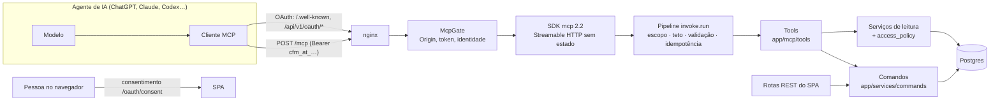

# Integração com agentes de IA (MCP)

O Controle Financeiro expõe um **servidor MCP** em `/mcp` para que agentes de IA —
ChatGPT, Claude, Claude Code, Codex, Gemini CLI, Antigravity e qualquer cliente MCP —
consultem e registrem finanças da conta de quem os conectou, com as mesmas regras
e permissões do app. A decisão e suas razões estão no
[ADR 0035](../adr/0035-integracao-com-agentes-de-ia-mcp.md).

| Documento | Para quê |
|---|---|
| [TOOLS.md](TOOLS.md) | Referência das 57 tools (gerada do código) |
| [CAPABILITY_MAP.md](CAPABILITY_MAP.md) | Toda rota do app → tool que a cobre ou motivo de não haver (gerado) |
| [AUTHENTICATION.md](AUTHENTICATION.md) | OAuth 2.1: descoberta, PKCE, CIMD/DCR, tokens, revogação |
| [CLIENT_SETUP.md](CLIENT_SETUP.md) | Como conectar cada cliente e anexar arquivo pelo terminal (verificado em 23/09/2026) |
| [OPENAI_APP.md](OPENAI_APP.md) | Apps no ChatGPT: UI, pacote de plugin, Developer Mode, submissão |
| [SECURITY.md](SECURITY.md) | Modelo de ameaças e controles |
| [PRIVACY.md](PRIVACY.md) | O que o agente vê, o que fica registrado, como revogar |
| [TESTING.md](TESTING.md) | Testes, evals e o MCP Inspector |
| [OPERATIONS.md](OPERATIONS.md) | Deploy, proxy, WAF, métricas, depuração, versionamento, rollback |

## Arquitetura



- **Uma fonte de regra.** As rotas REST e as tools chamam os MESMOS comandos
  (`app/services/commands/`), que fazem `flush` e deixam o `commit` para quem
  comanda a transação — o REST ou o pipeline do MCP.
- **Identidade só do token.** Nada de `user_id` nos argumentos.
- **Sem estado.** Cada chamada se basta; os únicos "estados" são explícitos:
  `idempotency_key` e `confirmation_token`.

## Onde está cada coisa

```
backend/app/
  mcp/
    asgi.py            McpGate: Origin, verificação do token, 401 com WWW-Authenticate
    server.py          MCPServer do SDK, recurso de UI, instruções
    registry.py        ToolSpec: a definição única de cada tool (SDK, pipeline e docs)
    invoke.py          pipeline de toda chamada
    errors.py          envelope de erro e códigos
    identity.py        quem chama (do token)
    idempotency.py     chave de idempotência (mcpoperation)
    confirmation.py    token de confirmação de massa (mcpconfirmation)
    uploads.py         link de envio de anexo pelo terminal (cfm_up_, uso único)
    items.py           itens da nota e ajustes → entrada do comando do app
    versioning.py      `version` (hash do estado) e `expected_version`
    version.py         versão do servidor (semver do contrato)
    rate_limit.py      teto por pessoa + cliente, com custo por tool
    audit.py           trilha mcptoolcall + log estruturado
    resolve.py         nomes → ids (AMBIGUOUS / NOT_FOUND)
    writes.py          divisão, papel de escrita, tipos de chave/token
    money.py dates.py  fronteira de dinheiro e datas
    capability_map.py  rota REST → tool ou motivo
    docs.py            gera TOOLS.md e CAPABILITY_MAP.md
    tools/             as 57 tools
    ui/widget.html     componente MCP Apps (gerado de frontend/src/mcp-widget)
  services/oauth/      authorization server (clientes, CIMD, códigos, tokens, concessões)
  services/commands/   comandos de escrita compartilhados com o REST
  api/routes/oauth.py          authorize/token/register/revoke + API do consentimento
  api/routes/well_known.py     metadados RFC 8414 / 9728 e verificação da OpenAI
  api/routes/ai_integrations.py  tela "Integrações com IA"
  api/routes/mcp_uploads.py      POST /api/v1/mcp/uploads (o curl do agente de terminal)
frontend/src/
  pages/OAuthConsentPage.tsx
  components/ai-integrations/  aba "Integrações com IA" e guias por cliente
  mcp-widget/                  componente MCP Apps
integrations/controle-financeiro-plugin/  pacote de plugin (ChatGPT/Codex) e skills
```

## Rodando localmente

```bash
# backend (de dentro de backend/, com o .env de lá)
cd backend && ../.venv/Scripts/python.exe -m uvicorn app.main:app --reload --port 8000
# frontend — o proxy do Vite encaminha /mcp, /.well-known e /api para o backend
cd frontend && npm run dev
# Inspector apontado para o issuer do dev
npx @modelcontextprotocol/inspector@latest   # URL: http://localhost:5173/mcp
```

Em desenvolvimento o issuer é o `FRONTEND_URL` (`http://localhost:5173`); os
clientes descobrem tudo a partir de um 401 do `/mcp`. Veja [TESTING.md](TESTING.md).

## Configuração

| Variável | Padrão | Efeito |
|---|---|---|
| `MCP_ENABLED` | `true` | `false` desliga `/mcp`, o OAuth e os metadados (404); a tela mostra "desativada" |
| `MCP_ACCESS_TOKEN_TTL_MINUTES` | `60` | Validade do access token |
| `MCP_REFRESH_TOKEN_TTL_DAYS` | `30` | Validade do refresh token (rotativo) |
| `MCP_AUTH_CODE_TTL_SECONDS` | `300` | Validade do código de autorização |
| `MCP_ALLOWED_ORIGINS` | vazio | Origens de navegador aceitas no `/mcp` (além do próprio site) |
| `MCP_CIMD_ENABLED` / `MCP_DCR_ENABLED` | `true` | Formas de registro de cliente |
| `MCP_RATE_LIMIT_UNITS_PER_MINUTE` | `120` | Teto de unidades por pessoa + cliente |
| `MCP_WRITE_RATE_LIMIT_PER_MINUTE` | `30` | Teto de escritas por pessoa + cliente |
| `MCP_BULK_MAX_ITEMS` | `200` | Máximo de lançamentos numa ação em massa |
| `MCP_FILE_URL_HOSTS` | `oaiusercontent.com` | Hosts de onde o servidor baixa o arquivo da conversa do ChatGPT (`attachments_add`); vazio desliga |
| `MCP_ATTACHMENT_TO_MODEL_MAX_BYTES` | `3145728` | Maior anexo entregue ao modelo em `attachments_get` |
| `OPENAI_APPS_CHALLENGE_TOKEN` | vazio | Resposta de `/.well-known/openai-apps-challenge` |
